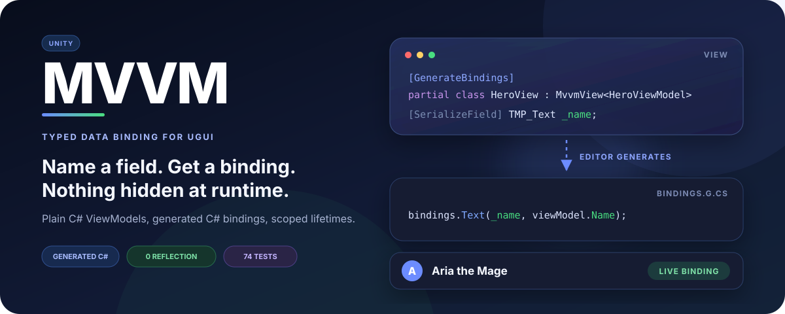
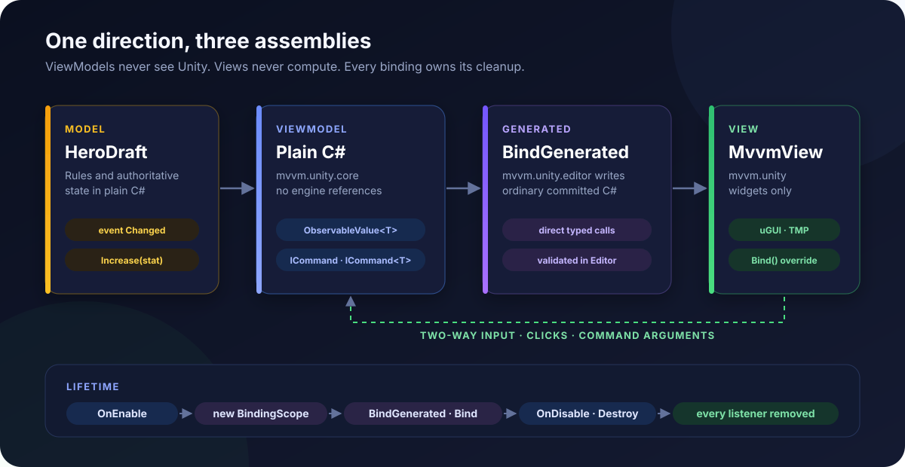
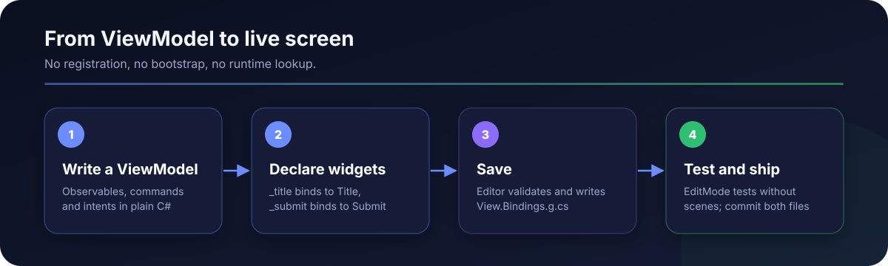

<p align="center">
  
</p>

<p align="center">
  <strong>Typed MVVM for Unity UI. Name a field, get a binding.</strong>
</p>

<p align="center">
  
  
  
  
</p>

# MVVM Unity

MVVM Unity is a small, dependency-free MVVM package for uGUI and TextMeshPro. ViewModels are plain C#; Views are MonoBehaviours whose bindings are generated in the Editor as ordinary, readable C#. At runtime a binding is a direct delegate subscription owned by a scope that the View disposes for you.

```text
Model -> ViewModel (observables, commands) -> generated bindings -> View (widgets)
```

- **Conventions first.** `[SerializeField] private TMP_Text _title;` binds to `ViewModel.Title`. Attributes exist only for aliases, extra bindings and ambiguity.
- **Compile-time safety.** Generated code calls members directly, so a rename breaks the build instead of a scene. Invalid bindings are reported with the View and field name.
- **No leaks by construction.** Every listener belongs to a `BindingScope`; ViewModels own their subscriptions through `Own`.
- **Dynamic content.** Snapshot rendering with a fresh scope per render keeps rebuilt rows free of stale listeners.
- **Testable.** ViewModels run in EditMode without scenes, GameObjects or mocks of Unity.
- **Nothing at runtime.** No reflection, expression trees, polling, `Update`, `Task` or third-party reactive library. IL2CPP and AOT friendly.

<p align="center">
  
</p>

## Contents

- [Install](#install)
- [Two-minute start](#two-minute-start)
- [What gets generated](#what-gets-generated)
- [Supported bindings](#supported-bindings)
- [Dynamic lists and custom controls](#dynamic-lists-and-custom-controls)
- [Character Creator sample](#character-creator-sample)
- [Validation](#validation)
- [Documentation](#documentation)

## Install

```json
{
  "dependencies": {
    "com.mvvm.unity": "https://github.com/datuloar/mvvm.unity.git"
  }
}
```

Requires Unity 2022.3 or newer with uGUI and TextMeshPro. Import the Character Creator sample from the Package Manager to see every feature in one screen.

## Two-minute start

<p align="center">
  
</p>

```csharp
using MvvmUnity.Core;

public sealed class CounterViewModel : ViewModel
{
    private readonly ObservableValue<int> _count = new ObservableValue<int>();
    private readonly ObservableValue<string> _label = new ObservableValue<string>("0");

    public CounterViewModel()
    {
        Own(_count.Subscribe(value => _label.Value = value.ToString()));
        Reset = Own(new RelayCommand(() => _count.Value = 0, () => _count.Value > 0).RefreshOn(_count));
    }

    public IReadOnlyObservableValue<string> Label => _label;

    public ICommand Reset { get; }

    public void Increase() => _count.Value++;
}
```

```csharp
using MvvmUnity.Unity;
using TMPro;
using UnityEngine;
using UnityEngine.UI;

[GenerateBindings]
public sealed partial class CounterView : MvvmView<CounterViewModel>
{
    [SerializeField] private TMP_Text _label;
    [SerializeField] private Button _increase;
    [SerializeField] private Button _reset;
}
```

```csharp
counterView.SetViewModel(new CounterViewModel(), ownsViewModel: true);
```

Save the scripts: bindings are generated on the next script reload. `_increase` calls the `Increase` method, `_reset` executes the command and follows its availability, `_label` displays the text.

## What gets generated

```csharp
public partial class CounterView
{
    [global::System.CodeDom.Compiler.GeneratedCode("MvvmUnity.BindingCodeGenerator", "2.0")]
    protected override void BindGenerated(
        global::MvvmUnity.Unity.BindingScope bindings,
        global::CounterViewModel viewModel)
    {
        bindings.Text(_label, viewModel.Label);
        bindings.Click(_increase, viewModel.Increase);
        bindings.Command(_reset, viewModel.Reset);
    }
}
```

The file is deterministic, lives in `Generated/` beside the View and is committed with it. Override `Bind` for anything custom; it runs after the generated bindings and never conflicts with them.

## Supported bindings

| Widget | ViewModel member | Binding |
| --- | --- | --- |
| `Text`, `TMP_Text` | `IReadOnlyObservableValue<string>` | text |
| `Image` | `IReadOnlyObservableValue<Sprite>` / `<float>` | sprite / fill |
| any `Graphic` | `IReadOnlyObservableValue<Color>` | color |
| `GameObject` | `IReadOnlyObservableValue<bool>` | active |
| `CanvasGroup` | `IReadOnlyObservableValue<bool>` | visible and interactive |
| any `Selectable` | `IReadOnlyObservableValue<bool>` | interactable |
| `Button` | `ICommand`, `ICommand<T>`, `void` method | click with availability |
| `Slider`, `Scrollbar` | `IObservableValue<float>` | two-way |
| `Toggle` | `IObservableValue<bool>` | two-way |
| `InputField`, `TMP_InputField` | `IObservableValue<string>` | two-way |
| `Dropdown`, `TMP_Dropdown` | `IObservableValue<int>` | two-way |

## Dynamic lists and custom controls

`StateViewModel<TState>` publishes one snapshot for a whole region. An `[Observe]` method with a `BindingScope` parameter receives a fresh scope for every render, and the previous scope is disposed first:

```csharp
[Observe]
private void Render(StatSheetState sheet, BindingScope bindings)
{
    for (var index = 0; index < sheet.Rows.Count; index++)
        RowAt(index).Render(sheet.Rows[index], ViewModel.Increase, ViewModel.Decrease, bindings);
}
```

A custom control needs one `BindingScope` extension that registers its own cleanup, called from a `Bind` override. See [Bindings](Documentation~/Bindings.md#custom-bindings).

## Character Creator sample

<p align="center">
  
</p>

<p align="center">
  
  
</p>

A complete hero creation screen with conventions, aliases, several bindings on one button, two-way input, dropdown, slider and toggle, color, fill, visibility and interactability bindings, a guarded command, parameterized row commands, snapshot rendering and a custom binding extension. Its ViewModel is covered by EditMode tests. See the [sample guide](Samples~/CharacterCreator/README.md).

## Validation

74 EditMode tests pass on Unity 2022.3 LTS and Unity 6.3: 61 package tests and 13 sample tests. They cover observables, commands, ViewModel and View lifetime, binding scopes, every built-in binding, the inference table, analyzer diagnostics and a check that committed generated code matches the generator.

`Tools~/validate.ps1` is the fast repository gate: no source comments, file size limits, namespaces, JSON, `.meta` files, unique GUIDs and documentation links.

## Documentation

- [Getting started](Documentation~/GettingStarted.md)
- [Bindings](Documentation~/Bindings.md)
- [Code generation](Documentation~/CodeGeneration.md)
- [Architecture](Documentation~/Architecture.md)
- [Testing and performance](Documentation~/TestingAndPerformance.md)

## License

MVVM Unity is available under the [MIT License](LICENSE).
