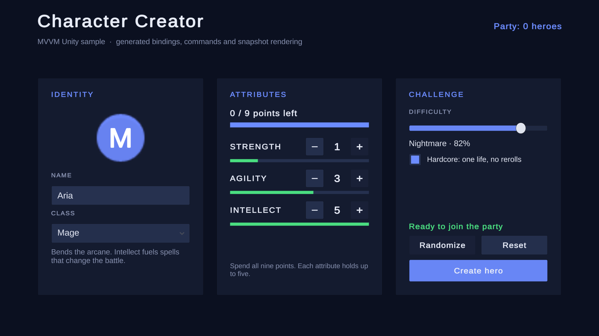
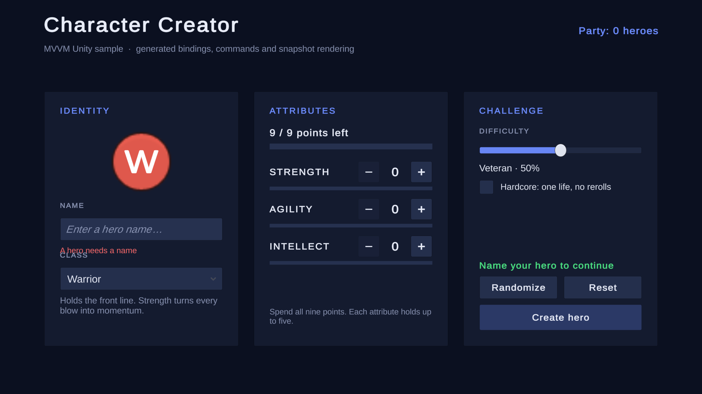
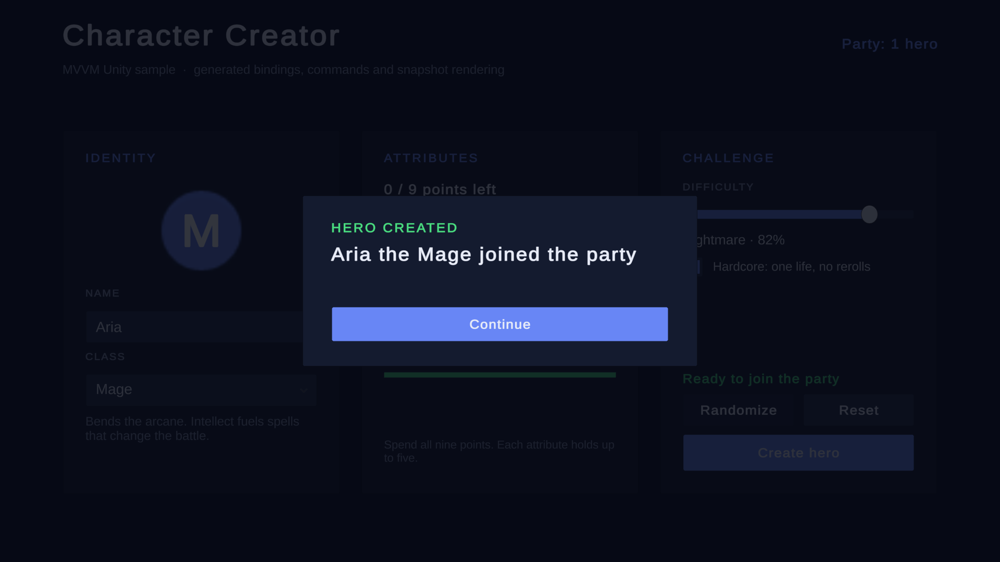

# Character Creator

A hero creation screen that exercises the whole package in one place. It uses uGUI, TextMeshPro and built-in sprites only.

Open `Scenes/CharacterCreator`, enter Play Mode, name a hero, pick a class, spend all nine attribute points and press **Create hero**. Import TMP Essential Resources first if the project has none.

## What it demonstrates

| Feature | Where |
| --- | --- |
| Convention bindings | Most `CharacterCreatorView` fields bind by name with no attributes |
| Alias binding | `_confirmationPanel` binds `ConfirmationVisible` through `[Bind]` |
| Several bindings on one widget | `_randomize` binds the `Randomize` intent and `CanRandomize` |
| Two-way controls | Name input, difficulty slider and hardcore toggle |
| Color, fill, active and visible targets | Class portrait, points bar, missing-name warning, confirmation overlay |
| Guarded command | `Create` follows the name and point budget through `RefreshOn` |
| Parameterized commands | Each stat row binds `Increase` and `Decrease` with its `HeroStat` |
| Snapshot rendering | `StateViewModel<StatSheetState>` rendered by `[Observe] Render(state, bindings)` |
| Custom binding | `ChoiceBindingExtensions.Choice` fills the class dropdown and binds its index from a `Bind` override |
| Lifetime | `Own` releases every subscription; `OnDispose` detaches the model event |
| Tests | `CharacterCreatorViewModelTests` and `HeroDraftTests` run in EditMode |

## Reading order

1. `CharacterCreatorEntryPoint` composes the model, roster and ViewModel.
2. `HeroDraft` holds the rules: the budget, the per-stat cap and random distribution.
3. `CharacterCreatorViewModel` turns the draft into presentation state and intents.
4. `CharacterCreatorView` declares widgets only; its bindings are in `Views/Generated`.
5. `StatRowView` paints one snapshot row and binds its buttons in the render scope.

The tests appear in `mvvm.unity.samples.character-creator.tests` when the Unity Test Framework is installed.
